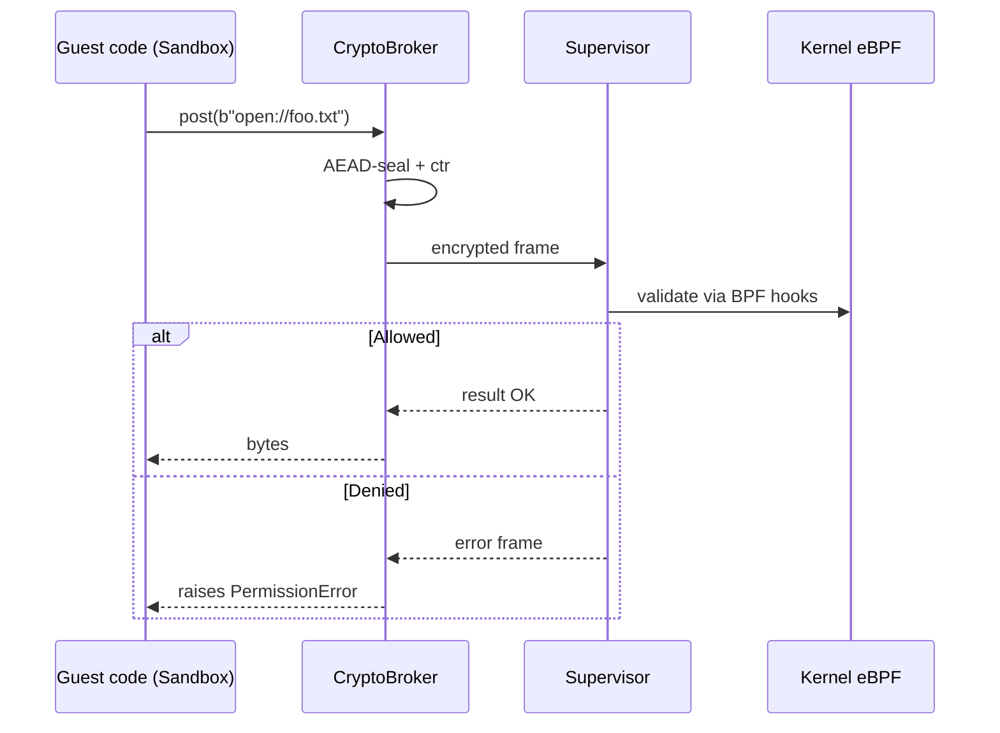
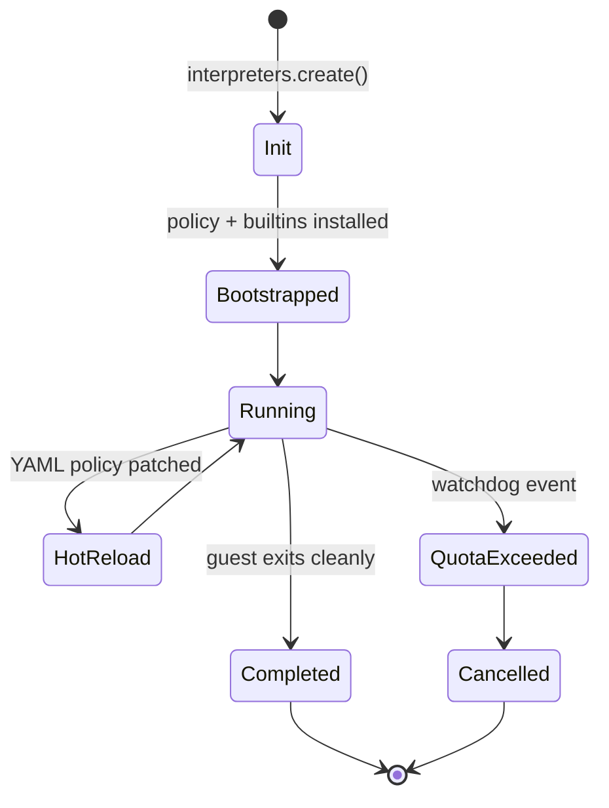

# PyIsolate Agents

This document describes the **runtime roles** inside PyIsolate. Each agent is an executable component (Python module, C helper, or eBPF object) with a *single responsibility*.

| Agent                | Thread / Context                                       | Responsibilities                                                                                             | Key Files                                 |
| -------------------- | ------------------------------------------------------ | ------------------------------------------------------------------------------------------------------------ | ----------------------------------------- |
| **Supervisor**       | Main process thread                                    | Owns root caps, spawns sub‑interpreters, loads/pins eBPF, negotiates crypto keys, exports metrics            | `supervisor.py`                           |
| **SandboxThread**    | One Linux thread per guest                             | Hosts sub‑interpreter; installs minimal builtins; runs user code; communicates over PEP 554 channel          | `runtime/thread.py`                       |
| **BPFManager**       | Async task in supervisor                               | Compiles CO‑RE objects, attaches LSM & cgroup programs, applies hot‑reload diff when `policy/*.yaml` changes | `bpf/manager.py`, `Makefile.bpf`          |
| **CryptoBroker**     | Same thread as supervisor                              | Frames/unframes AEAD packets, maintains per‑channel counters, exposes a capability RPC surface               | `broker/crypto.py`, `isocrypto.*`         |
| **ResourceWatchdog** | In‑kernel perf‑event BPF + userspace ringbuffer reader | Counts CPU ticks & RSS per cgroup; triggers `SIGXCPU` on quota breach                                        | `bpf/resource_guard.bpf.c`, `watchdog.py` |
| **MetricsExporter**  | Async task                                             | Samples BPF maps, converts to Prometheus `Gauge` & `Counter`                                                 | `observability/metrics.py`                |

---

## Message flow

---

## Lifecycle state machine

---

## Extending the system

1. **New guard type**
   *Add* a `*.bpf.c` file, declare maps, compile with `make bpf`, and register the skeleton in `bpf/manager.py`.
2. **New broker opcode**
   Add enum in `broker/opcodes.py`, implement handler, and document in `docs/protocol.md`.
3. **Custom metrics**
   Register metric in `observability/registry.py` and update Grafana dashboard JSON.

---

## Coding standards

* Agents must **never** share mutable global state—communicate via explicit channels.
* Keep error paths constant‑time where crypto is involved.
* All new eBPF code must pass `llvm‑objdump -d` + `bpftool prog load` & `verifier` in CI.

---

*Last updated:* <!-- generated -->
